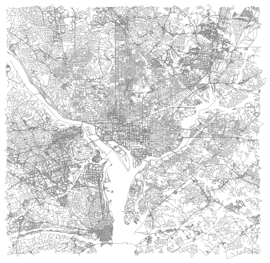

# Do bikeshare trips replace transit trips?
## Estimating transit travel times with UrbanAccess and Pandana

In just over a decade, bikeshare stations have become such a ubiquitous part of the urban landscape that it can be hard to remember what a recent addition they are. As bikeshare ridership has grown, so has curiosity about how a bikeshare system interacts with and influences the rest of a city's transportation network. One question of interest to transportation researchers is whether the relationship between bikeshare and transit is inherently competitive, with bikeshare providing a transit substitute that draws riders away. 

Research into aggregate ridership trends has uncovered some [interesting insights](https://journals.sagepub.com/doi/10.1177/0361198119849407) into where that might be true, and where it might not be. When thinking about it, though, I was interested in the more basic question of how often the decision to use bikeshare over transit really does represent a toss-up choice between two equally attractive alternatives, and how often bikeshare is the obvious better choice because no comparable transit alternative exists. In other words: How many bikeshare trips could just as easily be completed on transit, and how many connect places that would otherwise be much more time-consuming to reach?

This project is an attempt to answer that question, or at least begin to, by using multimodal network analysis to estimate the time it would take to replicate more than 22,000 individual Washington, D.C. bikeshare trips on the city's transit and pedestrian network. I combined features of the Python packages [UrbanAccess](https://github.com/UDST/urbanaccess) and [Pandana](https://github.com/UDST/pandana) -- developed to study regional accessibility, but with the ability to quickly compute shortest paths between individual points at large scale -- to estimate the fastest transit travel times between origin-destination pairs drawn from Capital Bikeshare ride history data. I used UrbanAccess to integrate heavy rail, bus, and streetcar routes and schedules with [OpenStreetMap](https://www.openstreetmap.org/)'s pedestrian network, and used Pandana's shortest path functionality to compute point-to-point travel times along the combined pedestrian-transit network.

***

## Data sources

I based this analysis on [Capital Bikeshare trip history data](https://www.capitalbikeshare.com/system-data) in General Bikeshare Feed Specification (GBFS) format for the month of November 2021. 

To build the transit network, I retrieved stop, route, and schedule data in [General Transit Feed Specification (GTFS)](https://developers.google.com/transit/gtfs) format from four separate feeds: Washington Metropolitan Area Transit Authority (WMATA) [bus](https://developer.wmata.com/docs/services/gtfs/operations/bus-gtfs-static) and [rail](https://developer.wmata.com/docs/services/gtfs/operations/5cdc5367acb52c9350f69753), the [D.C. Circulator](https://www.dccirculator.com/developer-resources/) bus, and the [D.C. Streetcar](https://dcstreetcar.com/developer-resources/). I retrieved street network data from OpenStreetMap through UrbanAccess.

***

## Creating the transit-pedestrian network

### Importing GTFS data

I based the workflow for creating the combined transit and street network on the UrbanAccess [demo notebook](https://github.com/UDST/urbanaccess/blob/master/demo/simple_example.ipynb), but adapting it to D.C. transit data ended up requiring some creative problem solving. UrbanAccess has built-in functions to download and extract GTFS data from multiple sources at once, but only if those sources have public URLs that don't require an API key. That covered the streetcar and Circulator bus, but not WMATA bus or rail, which represents the vast majority of D.C.'s transit service. Instead, I used WMATA's API to retrieve the agency's static rail and bus feeds, and used the `zipfile` package to extract them to UrbanAccess's default directory.

### Building the transit network

UrbanAccess processed the streetcar, Circulator, and WMATA bus data with no further issues, but the WMATA rail data used a different calendar format from the other three feeds -- a `calendar_dates.txt` file without a `calendar.txt` file, to be specific -- and none of the scheduled trains loaded into the transit network. Fortunately, the network creation function had a parameter for exactly this circumstance! Unfortunately, it involved filtering on a field that didn't exist in the WMATA rail calendar file -- nor, in fact, in [GTFS reference materials](https://developers.google.com/transit/gtfs/reference#calendar_datestxt).

I ultimately bypassed the issue with a a hacky little workaround:

1. open `calendar_dates.txt`
2. parse integer dates to a string date `pd.to_datetime()` will recognize
3. convert string dates to datetime
4. extract day of week as new column
5. drop the string and datetime date columns
6. overwrite `calendar_dates.txt` with this new version

It worked, but for a future project, I would want to find a less sketchy solution.

After generating the transit network, I used a different UrbanAccess function to calculate average headways (the time between scheduled trains or buses), which I chose to include in the network as a proxy for passenger wait times at pedestrian-to-transit connections.

A note about scope: UrbanAccess produces a static network object that draws its travel time estimates from transit schedules and average headways for a specified time window, which means that no single network can represent transit service at all points in time. The network I used for this exploratory analysis relies on a network built from transit schedules for _Mondays from 07:00 a.m. to 10:00 a.m._, and effectively represents weekday morning service from Monday to Friday. Applying this approach more broadly might involve creating a pipeline to loop through network creation and travel time estimation for a series of time windows covering the rest of the day and week.

### Adding the pedestrian network

Still within UrbanAccess, I downloaded OpenStreetMap nodes and edges for a bounding box around D.C., and created a time-weighted graph with a walking speed of 3 mph, which I combined with the transit network to create a final integrated network. (This part was as described in the tutorial, and I can take no credit.)

***

## Estimating transit travel times for bikeshare trips

After creating the integrated transit and pedestrian network, I imported and cleaned the bikeshare trip data before using Pandana to compute estimated travel times along the network for each coordinate pair.

### Preparing the bikeshare data

I downloaded Capital Bikeshare trip history data for November 2021, the most recent month available, to ensure that travel time estimates based on current transit schedules would be reasonably accurate. Another option might be to scrape GTFS feeds over a longer period to match schedules to trip dates, or to try using the [TransitLand API](https://www.transit.land/documentation/rest-api/feed_versions) to retrieve historic GTFS data.

To keep the number of transit operators manageable, I limited the spatial scope to trips that started and ended within the District of Columbia. I imported the city boundaries in GeoJSON form; converted the bikeshare trip dataframe to a GeoDataFrame with the start coordinates as the geometry; used a `within` spatial join to select trips that started inside the boundary; switched the GeoDataFrame geometry to the end coordinates; and used a second spatial join to select trips that ended within city limits.

From the trip timestamps, I extracted the start time, day of week, and date to be able to select trips matching the transit network's schedule window. I also calculated the duration of each trip for comparison with the travel network's estimates. Figuring out how to filter data by time and date without a datetime column as the dataframe index ended up being a surprisingly time-consuming part of this project, but learning about using `@` inside queries to reference outside variables was worth the lost time.

I excluded trips shorter than two minutes or longer than two hours, and trips that started and ended at the same docking station. This may have excluded some legitimate trips, but was meant to screen out records where a bike was checked out and immediately returned, or where the docking station did not correctly register a return.

The plan for this project included comparing travel patterns between docked and dockless trips, since the trip data included start and end coordinates for both. On closer inspection, I found that  the latitude and longitude data for dockless trips was reported at a much lower spatial resolution than for the docked trips, presumably to protect rider privacy. I reluctantly limited the analysis to docked trips, since equivalent travel times could not be estimated with any reasonable accuracy without a precise start and end location.

### Generating travel time estimates

Finally, I initialized a Pandana network from the UrbanAccess network's nodes and edges, and then used Pandana's `shortest_path_lengths()` function to compute the estimated travel time between each bikeshare trip's start and end coordinates along the pedestrian and transit network. After all the build-up, this part of the project was completely uneventful and much faster than I expected.

***

## Comparing bikeshare ride times to transit estimates

I wrote about the results of this analysis in much greater depth for a transportation planning class, but in short: 

* Estimated transit-walking times followed a roughly normal distribution, while bikeshare trips skewed toward shorter average trip times with a substantially longer tail.

* The longest bikeshare trip was more than twice as long as the longest travel estimate, which might be indicative of biking for leisure and not just as transportation, or might just be an artifact of a returned bike not being recognized as such in the system.

* Mean and median bikeshare ride times (about 12 and 10 minutes, respectively) were substantially shorter than the mean and median travel estimates (both around 19 minutes). This seems to at least tentatively support the hypothesis that riders tend to choose bikeshare when they know it to be faster than their best transit or walking option.

* The mean ratio of estimated travel time to recorded ride time was 1.93; the median was 1.88. 

For more discussion of the results from a transportation planning perspective, a PDF of the paper can be found [here](./cpln-550-final-paper.pdf).

***

## Were the estimates accurate? 

To see if the network's travel time estimates were anywhere near accurate, I manually spot-checked a random sample of origin-destination pairs against Google Maps transit time estimates for the same trip at the same time of day. I found that UrbanAccess/Pandana estimates were usually comparable to the lower end of Google's transit estimates for the same trip, and more often underestimated than overestimated travel time compared to Google Maps.

One important caveat, though: When analyzing the data later on, I ran across a handful of origin-destination clusters where network trip time estimates were several times larger than what they should be, for no immediately apparent reason. These errors were few enough not to invalidate the entire analysis, but serious enough to need resolution before this method can be relied on for more serious work. My first guess is that a few missing or disconnected nodes or edges might be causing routing errors in specific parts of the network, but without more troubleshooting it's hard to say.

***

## Some final thoughts

Setting aside the challenges I encountered with the WMATA data, UrbanAccess is an incredibly impressive package with applications beyond its intended regional accessibility use case. Its travel time estimates leaned optimistic (consistent with the transit schedules it relies on), and the occasional large and mystifying errors made it unsuitable for evaluating individual trips -- but in the aggregate, the results were plausible and provided an interesting angle from which to examine the relationship between bikeshare and transit.

From a technical perspective, beyond learning some interesting things about file I/O, datetime manipulation, and fun ways to `.query()` dataframes, this project was an exercise in how to solve problems when the package you're learning is too niche for any of the errors you're encountering to have a question on Stack Overflow, never mind an answer. It was a steep learning curve, but it also left me feeling much more comfortable working in Python than I did a couple of weeks ago, and I'm excited to keep taking on more projects that will do the same.